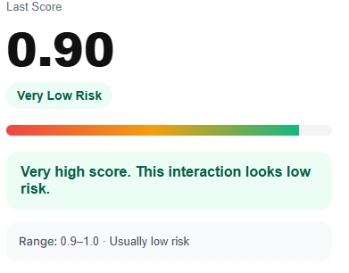
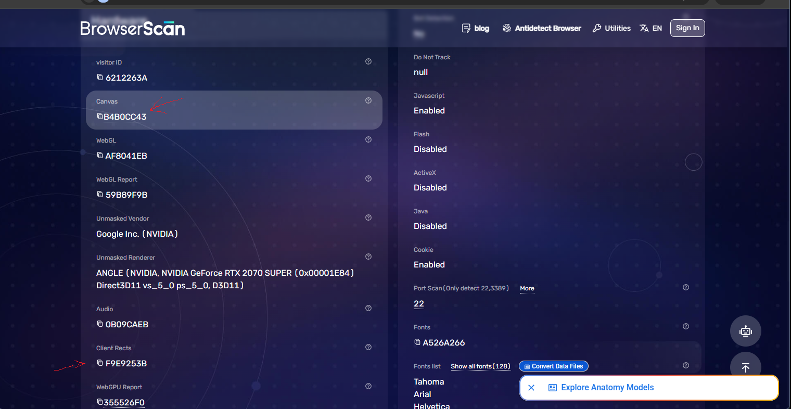
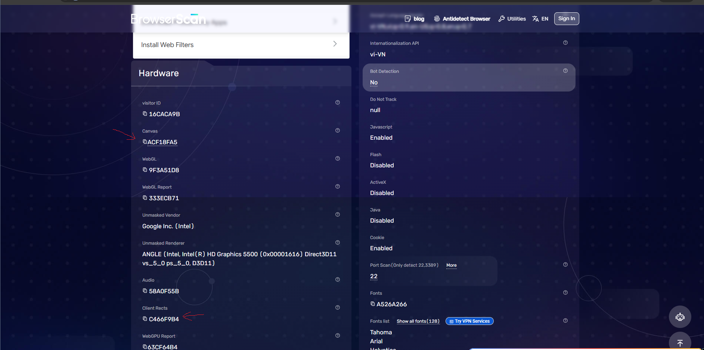

# Phantom Array Launcher

<p align="center">
  <strong>Every profile. A unique destiny.</strong>
</p>

<p align="center">
  A portable Windows desktop launcher for managing isolated browser profiles with flexible environment and fingerprint customization.
</p>

<p align="center">
  <a href="https://github.com/phantomarray/phantom_array_launcher/releases/tag/v1.0.0">Download v1.0.0</a>
  ·
  <a href="https://github.com/phantomarray/phantom_array_launcher/releases">All Releases</a>
</p>

---

## Overview

**Phantom Array Launcher** is a portable Windows application built for users who need to create, manage, and launch separate browser profiles from one place.

Each profile can maintain its own browser environment, fingerprint configuration, proxy settings, cookies, local data, and screen/window parameters.

The launcher is distributed as a standalone executable — **no installer is required**.

> **No installation. No mandatory account. One launcher. Multiple environments.**

---

## Screenshots

<p align="center">
  
</p>

<p align="center">
  
</p>

<p align="center">
  
</p>

---

## Features

### Profile Management

Manage multiple browser profiles from a single workspace.

- Create and manage independent profiles
- Edit profile configuration
- Duplicate profiles
- Delete profiles
- Launch profiles independently
- Persistent local profile data

### Browser Environment Customization

Configure browser-environment parameters on a per-profile basis.

Supported areas include:

- Fingerprint configuration
- Canvas
- ClientRects
- Screen configuration
- Window configuration
- Proxy configuration
- Browser profile data

### Fingerprint Library

Create and reuse fingerprint configurations across profiles.

The Fingerprint Library supports importing fingerprint configuration data from files and applying reusable configurations to browser profiles.

### Proxy Support

Configure proxies independently for browser profiles.

The launcher supports:

- HTTP proxies
- SOCKS5 proxies
- Proxy authentication
- Proxy connectivity testing
- Geographic information
- Cached proxy test results

Proxy test results are cached to reduce unnecessary repeated checks while keeping profile launches responsive.

### Screen & Window Configuration

Customize screen and browser-window parameters for individual profiles.

This includes configurable values such as:

- Screen width and height
- Available screen dimensions
- Color depth
- Pixel depth
- Window width and height
- Browser viewport dimensions

### Portable by Design

Phantom Array Launcher is delivered as a portable Windows executable.

**No installer. No setup wizard.**

Download the executable, run it, and start using the launcher.

---

## Getting Started

### 1. Download

Get the latest Windows x64 build from the GitHub Releases page:

**[Download Phantom Array Launcher v1.0.0](https://github.com/phantomarray/phantom_array_launcher/releases/tag/v1.0.0)**

### 2. Run

Launch:

```text
Phantom-Array-Launcher-portable-win-x64.exe
```

No installation is required.

### 3. Create a Profile

Create a new profile and configure its browser environment.

### 4. Configure

Customize the profile's fingerprint, proxy, screen, window, and other available settings.

### 5. Launch

Select the profile and launch its browser environment.

---

## System Requirements

| Requirement | Specification |
|---|---|
| Operating System | Windows 10 / Windows 11 |
| Architecture | x64 |
| Installation | Not required |
| Internet Connection | Required for network-dependent features |

---

## Premium

Phantom Array Launcher includes an integrated Premium Store for premium products and services.

Premium features and entitlements are managed through the launcher and may vary by release.

For the current release, see the **Premium Store** inside the application.

---

## Privacy & Data

Phantom Array Launcher is designed around local profile management and independent browser environments.

Profile data is maintained locally on the user's machine.

A mandatory user account is not required for local profile management.

Internet connectivity may be required for network-dependent functionality, including:

- Proxy testing
- Geographic information
- Premium license validation
- Premium Store access

---

## Security

Application and profile data use application-level protection and local machine identity binding.

Premium licensing uses cryptographic validation designed to associate entitlements with the local environment.

Security features are intended to protect application data and licensing integrity. No software can guarantee complete protection against reverse engineering or determined runtime tampering.

---

## Release

### v1.0.0

**Phantom Array Launcher v1.0.0** is the initial public release.

**Platform:** Windows x64  
**Distribution:** Portable executable  
**Installer:** Not required

**[Download Phantom Array Launcher v1.0.0 →](https://github.com/phantomarray/phantom_array_launcher/releases/tag/v1.0.0)**

---

## Versioning

Releases follow semantic versioning:

```text
MAJOR.MINOR.PATCH
```

Examples:

```text
v1.0.0
v1.0.1
v1.1.0
v2.0.0
```

---

## Roadmap

Phantom Array Launcher is under active development.

Future releases may include improvements such as:

- Performance optimizations
- Additional fingerprint controls
- Expanded profile management
- Additional proxy capabilities
- UI and workflow improvements
- Additional Premium features

The roadmap is subject to change as the product evolves.

---

## Support

For bug reports, feature requests, and product-related discussions, please use the project's GitHub Issues or the appropriate support channel.

When reporting an issue, include:

- Phantom Array Launcher version
- Windows version
- Steps to reproduce
- Expected behavior
- Actual behavior
- Relevant screenshots or logs

---

## Distribution & Source Code

This repository is used to distribute the compiled Phantom Array Launcher application.

The application's private source code is not included in the public repository.

The distributed executable is proprietary software. Redistribution, modification, or reverse engineering is subject to applicable law and the terms under which the software is provided.

---

<p align="center">
  <strong>Phantom Array Launcher</strong>
  <br>
  Every profile. A unique destiny.
</p>
